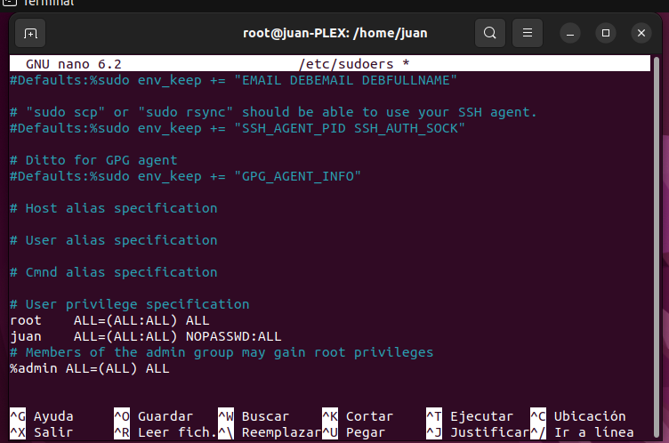

## Primeros pasos

En primer lugar debemos señalar que dicho proyecto se hizo sobre una máquina virtual Ubuntu 22.04 LTS, pero también se puede hacer desde otros sistemas operativos distintos. En este caso lo escogí debido a que se me hacía mas amigable el entorno gráfico y de comandos. Pero repito que sirve para cualquier sistema operativo, cambiando por supuesto comandos y nombres.

Una vez tengamos operativa nuestra máquina virtual, procederemos a meter a nuestro usuario en el fichero sudoers, con el objetivo de intentar utilizar lo menos posible el sudo, debido a ciertas complicaciones que nos podrían dar en un futuro con el tema de permisos etc.

---
