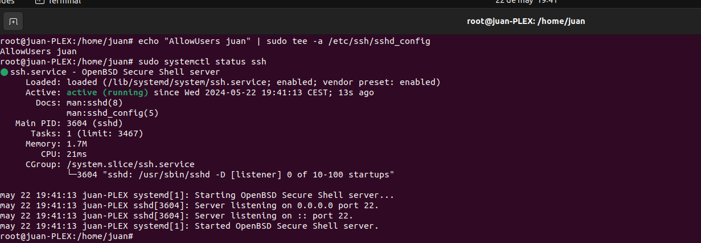
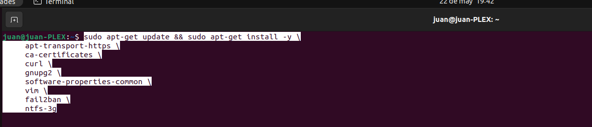
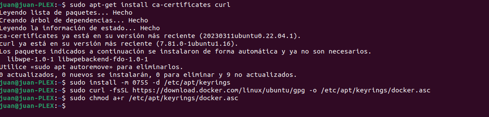
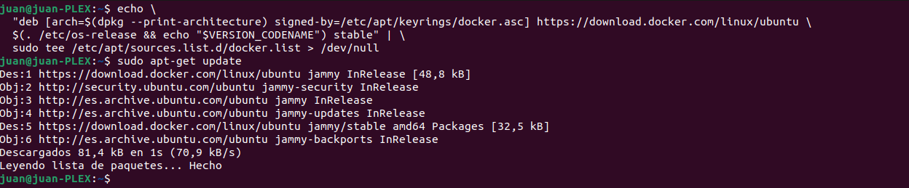
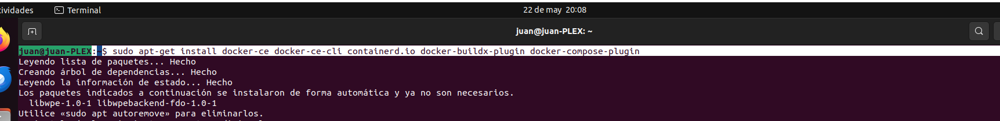
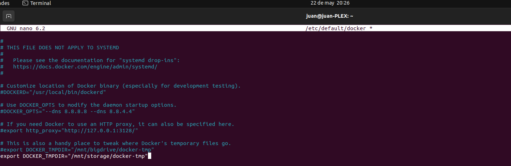
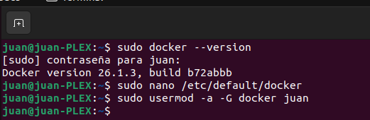
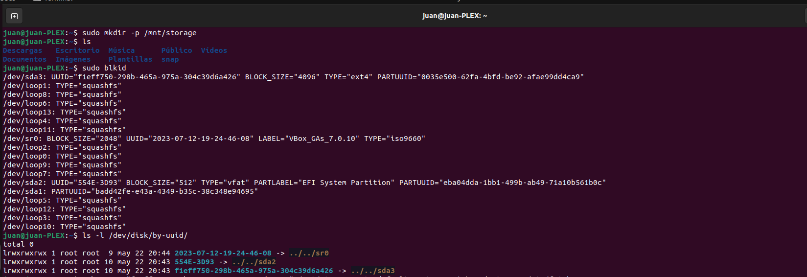
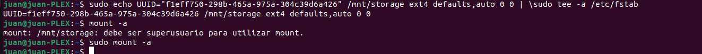
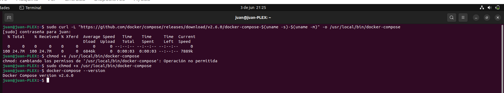

## Primeros pasos

En primer lugar debemos señalar que dicho proyecto se hizo sobre una máquina virtual Ubuntu 22.04 LTS, pero también se puede hacer desde otros sistemas operativos distintos. En este caso lo escogí debido a que se me hacía mas amigable el entorno gráfico y de comandos. Pero repito que sirve para cualquier sistema operativo, cambiando por supuesto comandos y nombres.

**¡¡ IMPORTANTE !!** Solo es necesario crear el archivo .env y el docker-compose.yml, y algunos directorios que veremos mas adelante. Al levantar nuestro docker-compose.yml este creará los directorios FLEXGET y TRANSMISSION automáticamente, y solo tendremos que modificar algunos de sus archivos. Y por supuesto ¡¡ CUALQUIER INSTALACION O CREACIÓN SE HARÁ DESDE LA MISMA UBICACIÓN !!.

Una vez tengamos operativa nuestra máquina virtual, procederemos a meter a nuestro usuario en el fichero sudoers, con el objetivo de intentar utilizar lo menos posible el sudo, debido a ciertas complicaciones que nos podrían dar en un futuro con el tema de permisos etc.

---

Tras esto, permitimos que dicho usuario acceda a través de ssh, y comprobamos el servicio.

---

Ahora ya podemos empezar a instalar los paquetes previos a la instalación de docker (Vienen en la bibliografía)

---

## Instalación Docker

Todos los comandos de la instalación de docker vienen de su página oficial, en el caso de la bibliografía mostrada de pablokbs viene desactualizada. Estos son los pasos a seguir.

---

Ahora procederemos a preparar la carpeta donde montaremos docker (Tambien metemos en docker a nuestro usuario). Creando el directorio /mnt/storage/ que veremos mas adelante.

---

## Instalación Docker-compose

En este caso, al instalar docker docker no se instala docker-compose, para ello utilizaremos los siguiente comandos.

Una vez instalado ya podremos crear contenedores en un solo archivo .yml

---

