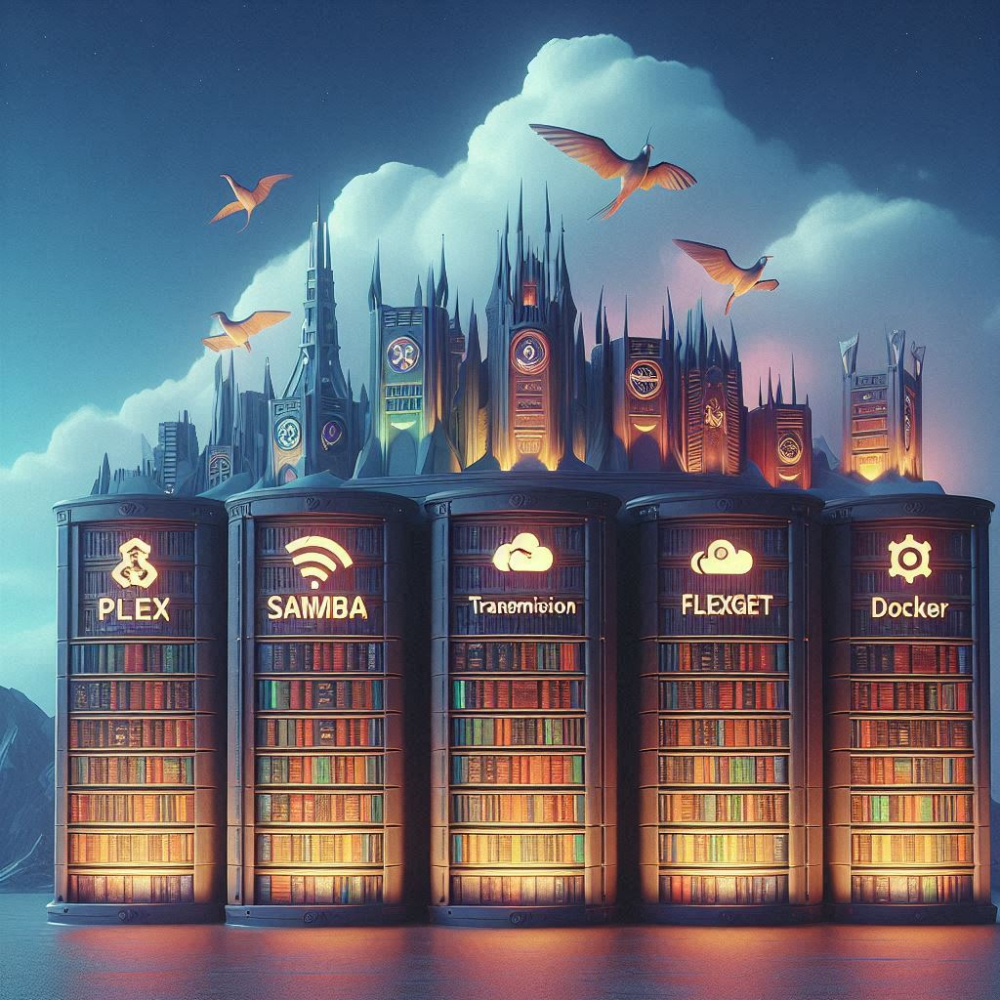

# Proyecto-Biblioteca Multimedia con PLEX

Este proyecto describe cómo configurar una biblioteca multimedia utilizando PLEX. 

También utilizaré Samba como servidor para compartir uno o mas sistemas de archivos, Flexget para automatizar las descargas que llegan de transmission, y vincularlas directamente con nuestro plex. Todo esto dentro de Docker.

Cabe destacar que de todos estos programas y servicios, no he visto ninguno, tampoco Docker a diferencia de mis compañeros de clase.

A continuación, se detallan los pasos para la preparación del entorno, configuración de Docker Compose, implementación y resultados.

## Preparación del entorno

1. Instalar Docker y Docker Compose.

## docker-compose

1. Crear un archivo `docker-compose.yml` con la configuración de los servicios necesarios (Samba, Plex, Transmission, FlexGet).
2. Levantar los contenedores con `docker-compose up -d`.

## Implementación

1. Configurar FlexGet para descargar y organizar el contenido.
2. Asegurarse de que los permisos de las carpetas sean correctos para que Plex pueda acceder a ellas.

## Resultados

1. Verificar que Plex haya indexado correctamente los archivos multimedia.
2. Disfrutar del contenido organizado en tu biblioteca Plex.

## Licencia

Este proyecto está licenciado bajo los términos de la [Licencia Creative Commons](https://creativecommons.org/licenses/by/4.0/).

